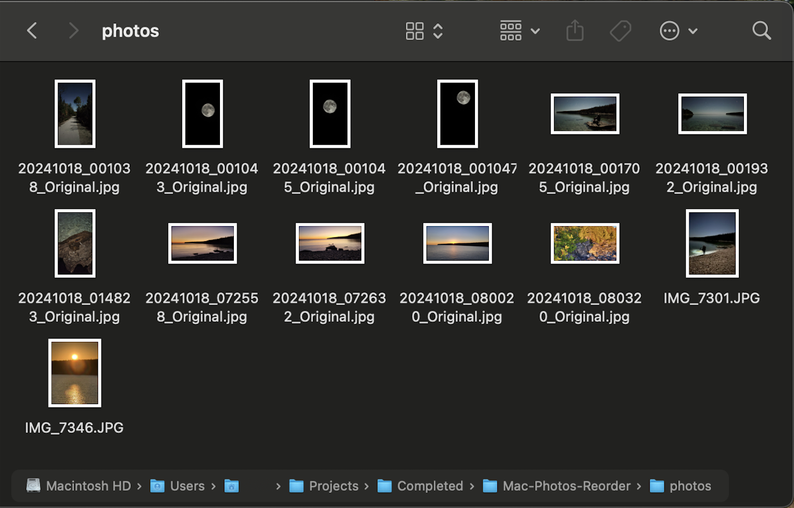
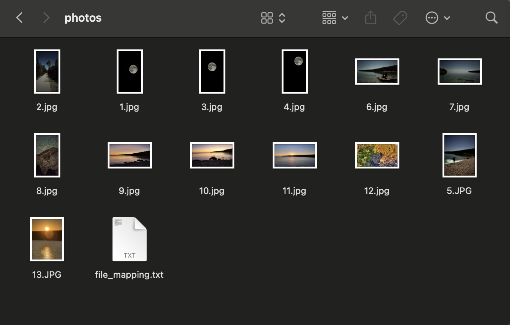
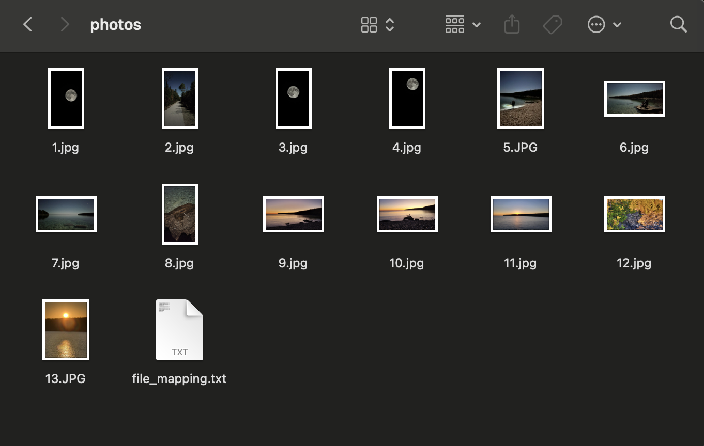
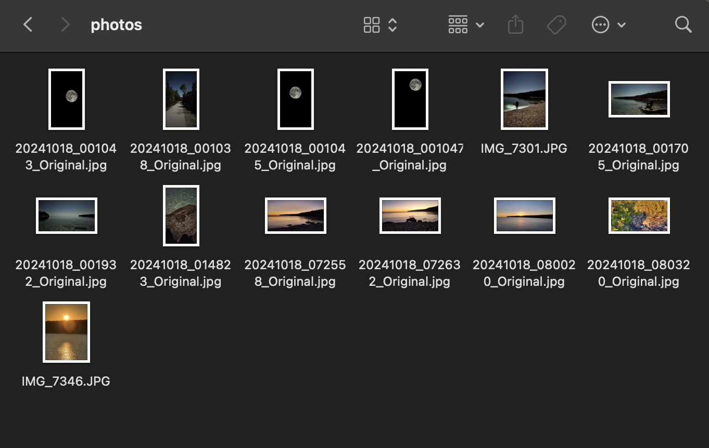

# Mac Photos Reorganizer

### Description: Easily reorder your photos in chronological order in Icon mode.

Note: Head over to **Discussions** if you have any questions about the app. I would appreciate any feedback and would love some reviews so I know I was able to help you guys! 😄

---

## The Problem ❌

When transferring photos from an iPhone to a Mac, they often lose their chronological order due to file naming issues.

- Mac Finder does not allow sorting photos in **icon view** by oldest to newest.
- The **'Clean Up By'** function only works in reverse chronological order.

## The Solution ✅

This tool temporarily renames your files from 1->\_\_ in their chronological Date Created order, allowing you to sort them in the correct order before restoring their original names.

---

## 📖 Table of Contents

- [How It Works](#how-it-works)
- [For Non-Coders 🖥️](#for-non-coders-)
- [Prerequisites 🛠️](#prerequisites-)
- [Running the Scripts 🚀](#running-the-scripts-)
- [Notes 📌](#notes-)
- [License 📜](#license-)

---

## How It Works

### Step 1️⃣: Prepare Your Files

Place all the images you want to reorder into a folder named **`photos`** inside the same directory as the Python scripts.

> 📷 **Example Directory Structure:**
>
> ```
> /Mac-Photos-Reorganizer/
> ├── step1-rename.py
> ├── step2-reverse.py
> ├── photos/
> │   ├── IMG_1234.JPG
> │   ├── IMG_5678.JPG
> │   ├── IMG_9101.JPG
> ```



---

### Step 2️⃣: Rename Files

Run `step1-rename.py` to rename all files inside the **photos** folder to a sequential order (1, 2, 3, ...).

```sh
python step1-rename.py
```

This will:

- Rename all files to numbers (`1.jpg`, `2.jpg`, `3.jpg`, ...).
- Create a text file storing the original names (DO NOT DELETE THIS FILE).



---

### Step 3️⃣: Sort Files

1. Open the **photos** folder in Finder.
2. Right-click and choose **'Clean Up By Name'**.

Now, your files are arranged in chronological order.



---

### Step 4️⃣: Restore Original Names

Run `step2-reverse.py` to revert the files to their original names.

```sh
python step2-reverse.py
```

This will:

- Restore the original filenames.
- Delete the additional text file.



---

### Step 5️⃣: Move & Organize

- Drag the **photos** folder to your desired location.
- Rename it if needed.

🎉 Done! Your photos are now correctly ordered!

---

## For Non-Coders 🖥️

If you're not familiar with coding, follow these simple steps to use this tool:

1. **Download the repository**

   - Click on the green **"Code"** button at the top of the repository page.
   - Select **"Download ZIP"**.
   - Extract (unzip) the downloaded file.

2. **Add Photos**

   - Add your photos to the "photos" folder or drag your folder of images into this directory and rename it to 'photos'
   - **\*Note:** It must be named photos. No upper case or extra spaces, etc.

3. **Open Terminal**

   - Press `Command + Space` and type **Terminal**, then press `Enter`.
   - Navigate to the unzipped folder by typing:
     ```sh
     cd /path/to/Mac-Photos-Reorganizer
     ```
   - Replace `/path/to/` with the actual folder location.
   - **\*Note**: If you don't know how to find the path to the folder. Follow this.
     - Right-click the folder.
     - Press option (⌥) and the 'Copy' button should switch to "Copy '\_\_\_\_' as Pathname.
     - Click that and the path name will be copied to your clipboard. It should be something like this '/Users/**your-name**/Desktop/**Mac-Photos-Reorder**'

4. **Run the scripts**
   - Type the following command to rename files:
     ```sh
     python step1-rename.py
     ```
   - Go to the 'photos' folder and then right-click. Press **'Clean Up By -> Name'**.
   - Once sorted in Finder, restore filenames by running:
     ```sh
     python step2-reverse.py
     ```
5. **Drag the folder into your desired location**
   - Do not select all images and drag them since it will distort the order
     ```sh
     python step1-rename.py
     ```
   - Go to the 'photos' folder and then right-click. Press **'Clean Up By -> Name'**.
   - Once sorted in Finder, restore filenames by running:
     ```sh
     python step2-reverse.py
     ```

Now your photos are organized correctly!

---

## Prerequisites 🛠️

- **Python 3** installed on your Mac.

## Running the Scripts 🚀

Open **Terminal** and navigate to the project folder:

```sh
cd /path/to/Mac-Photos-Reorganizer
```

Run the scripts:

```sh
python step1-rename.py
```

```sh
python step2-reverse.py
```

---

## Notes 📌

- Do **NOT** delete the `.txt` file created by `step1-rename.py` before running `step2-reverse.py`.
- Works with **any file type**.
- If any issues arise, ensure all files in `photos/` have valid timestamps.

---

## License 📜

This project is open-source under the MIT License.

---

💡 **Enjoy hassle-free photo organization on your Mac!** 🖼️
